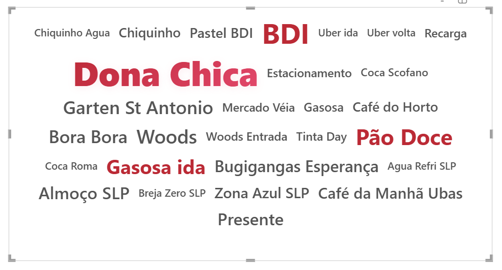

# Visuais personalizados em HTML

Os visuais são criados utilizando medidas DAX + o visual custom do Power BI HTML Content

## 1. Nuvem de palavras

### Código DAX para o visual [aqui](./visuals/cloud_of_words.txt)
